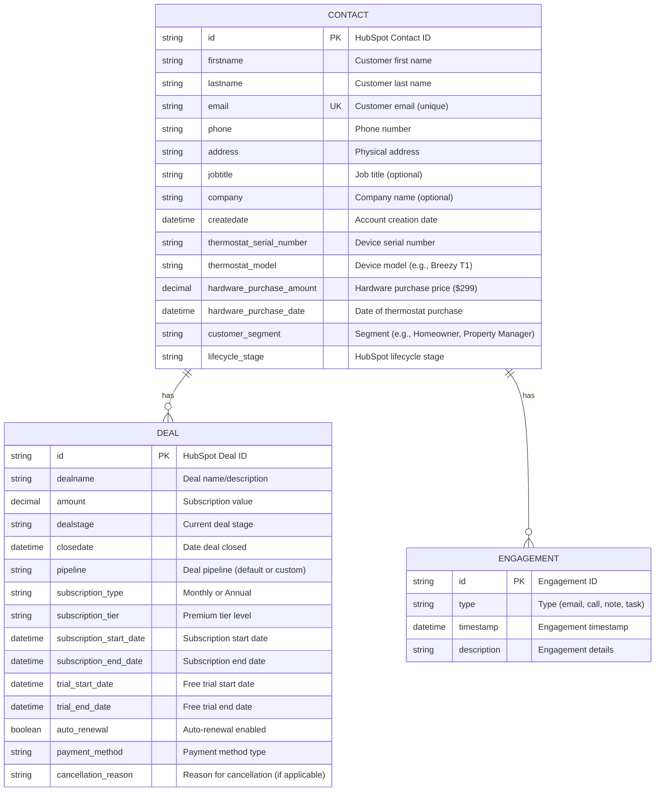
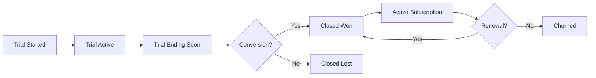
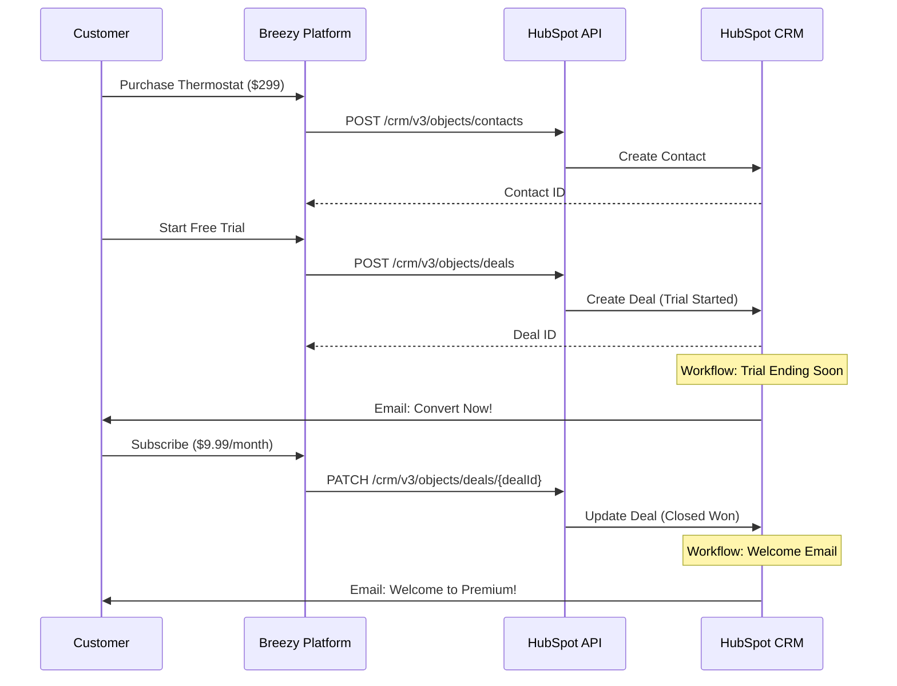
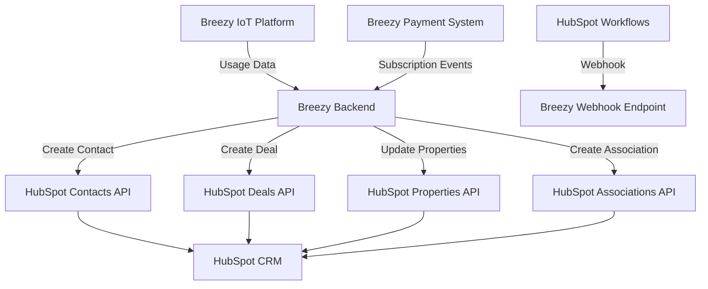

# HubSpot Data Architecture for Breezy Integration

## Executive Summary

This document outlines the recommended HubSpot CRM data architecture for Breezy's smart thermostat platform integration. The architecture leverages HubSpot's standard CRM objects (Contacts and Deals) with custom properties to track the customer journey from hardware purchase through subscription conversion.

**Key Design Principles:**
- Leverage standard HubSpot objects to minimize complexity
- Use custom properties to capture Breezy-specific data
- Implement clear association patterns between objects
- Design for scalability and future feature expansion
- Maintain data integrity through proper validation

---

## Entity Relationship Diagram (ERD)



### Relationship Cardinality

- **Contact to Deal**: One-to-Many (1:N)
  - A single contact can have multiple deals (e.g., monthly subscription, then upgrade to annual)
  - Each deal is associated with exactly one contact
  - Association Type ID: 3 (Deal to Contact - HubSpot standard)

- **Contact to Engagement**: One-to-Many (1:N)
  - Contacts can have multiple engagements (emails, calls, notes)
  - Used for tracking customer interactions and support tickets

---

## HubSpot Object Structure

### 1. Contact Object

**Purpose**: Represents a customer who has purchased a Breezy thermostat and created an account.

#### Standard Properties (HubSpot Default)

| Property | Type | Required | Description |
|----------|------|----------|-------------|
| `firstname` | String | Yes | Customer's first name |
| `lastname` | String | Yes | Customer's last name |
| `email` | String | Yes | Customer's email (unique identifier) |
| `phone` | String | No | Customer's phone number |
| `address` | String | No | Customer's physical address |
| `jobtitle` | String | No | Customer's job title |
| `company` | String | No | Customer's company name |
| `createdate` | DateTime | Auto | Date contact was created in HubSpot |
| `lastmodifieddate` | DateTime | Auto | Last modification timestamp |
| `lifecyclestage` | String | Auto | HubSpot lifecycle stage (lead, customer, etc.) |

#### Recommended Custom Properties

| Property | Type | Required | Description | Example |
|----------|------|----------|-------------|---------|
| `thermostat_serial_number` | String | Yes | Unique device identifier | `BRZ-T1-2025-001234` |
| `thermostat_model` | String | Yes | Device model name | `Breezy T1`, `Breezy T2 Pro` |
| `hardware_purchase_amount` | Number | Yes | Hardware purchase price | `299.00` |
| `hardware_purchase_date` | Date | Yes | Date of thermostat purchase | `2025-01-15` |
| `customer_segment` | Dropdown | No | Customer type | `Homeowner`, `Property Manager`, `Business` |
| `installation_date` | Date | No | Date thermostat was installed | `2025-01-20` |
| `installation_type` | Dropdown | No | Installation method | `Self-Install`, `Professional Install` |
| `home_size_sqft` | Number | No | Home size for analytics | `2500` |
| `hvac_system_type` | Dropdown | No | HVAC system type | `Central AC`, `Heat Pump`, `Dual Fuel` |
| `referral_source` | Dropdown | No | How customer found Breezy | `Google`, `Amazon`, `Referral`, `Retail` |
| `account_status` | Dropdown | Yes | Current account status | `Active`, `Trial`, `Churned`, `Suspended` |
| `trial_started` | Boolean | No | Whether customer started trial | `true`, `false` |
| `trial_converted` | Boolean | No | Whether trial converted to paid | `true`, `false` |

#### Contact Lifecycle Stages

| Stage | Description | Trigger |
|-------|-------------|---------|
| `lead` | Potential customer (not yet purchased) | Marketing qualified lead |
| `customer` | Purchased thermostat | Hardware purchase completed |
| `opportunity` | Active trial user | Free trial started |
| `evangelist` | Paid subscriber + referrals | Subscription active + referred others |

### 2. Deal Object

**Purpose**: Represents a subscription conversion from free trial to paid Breezy Premium service.

#### Standard Properties (HubSpot Default)

| Property | Type | Required | Description |
|----------|------|----------|-------------|
| `dealname` | String | Yes | Deal name/description |
| `amount` | Number | Yes | Subscription value (monthly or annual) |
| `dealstage` | String | Yes | Current stage in pipeline |
| `closedate` | Date | Auto | Date deal was closed |
| `pipeline` | String | Yes | Pipeline name (default or custom) |
| `createdate` | DateTime | Auto | Date deal was created |
| `hs_lastmodifieddate` | DateTime | Auto | Last modification timestamp |

#### Recommended Custom Properties

| Property | Type | Required | Description | Example |
|----------|------|----------|-------------|---------|
| `subscription_type` | Dropdown | Yes | Billing frequency | `Monthly`, `Annual` |
| `subscription_tier` | Dropdown | Yes | Service tier | `Premium`, `Premium Plus` (future) |
| `subscription_start_date` | Date | Yes | Subscription start date | `2025-02-01` |
| `subscription_end_date` | Date | No | Subscription end date (if cancelled) | `2026-02-01` |
| `trial_start_date` | Date | No | Free trial start date | `2025-01-15` |
| `trial_end_date` | Date | No | Free trial end date | `2025-01-30` |
| `trial_duration_days` | Number | No | Length of trial period | `14`, `30` |
| `auto_renewal` | Boolean | Yes | Auto-renewal enabled | `true`, `false` |
| `payment_method` | Dropdown | No | Payment method type | `Credit Card`, `PayPal`, `ACH` |
| `discount_code` | String | No | Promotional code used | `WINTER2025` |
| `discount_amount` | Number | No | Discount applied | `20.00` |
| `mrr` | Number | Yes | Monthly Recurring Revenue | `9.99` or `8.25` (annual/12) |
| `arr` | Number | Yes | Annual Recurring Revenue | `119.88` or `99.00` |
| `cancellation_reason` | Dropdown | No | Reason for cancellation | `Too Expensive`, `Not Using`, `Technical Issues` |
| `cancellation_date` | Date | No | Date subscription was cancelled | `2025-06-15` |
| `churn_risk_score` | Number | No | Predicted churn risk (0-100) | `35` |
| `feature_usage_score` | Number | No | Product engagement score (0-100) | `78` |

---

## Deal Pipeline Architecture

### Recommended Pipeline: "Breezy Subscription Pipeline"

This custom pipeline tracks the subscription conversion journey from trial to paid customer.



#### Pipeline Stages

| Stage | Stage ID | Description | Probability | Actions |
|-------|----------|-------------|-------------|---------|
| **Trial Started** | `trialstarted` | Customer activated free trial | 10% | Send welcome email, onboarding sequence |
| **Trial Active** | `trialactive` | Customer actively using trial | 30% | Monitor usage, send feature tips |
| **Trial Ending Soon** | `trialending` | Trial expires in 3-5 days | 50% | Send conversion reminder, offer discount |
| **Closed Won** | `closedwon` | Customer converted to paid | 100% | Send thank you, enable premium features |
| **Closed Lost** | `closedlost` | Trial ended without conversion | 0% | Send feedback survey, nurture campaign |
| **Active Subscription** | `activesubscription` | Ongoing paid subscription | 100% | Monitor usage, upsell opportunities |
| **Renewal Pending** | `renewalpending` | Subscription renewal approaching | 80% | Send renewal reminder |
| **Churned** | `churned` | Subscription cancelled | 0% | Exit survey, win-back campaign |

#### Stage Transition Rules

1. **Trial Started → Trial Active**
   - Automatic after 24 hours if customer logs in
   - Manual if customer completes onboarding

2. **Trial Active → Trial Ending Soon**
   - Automatic when 3 days remain in trial
   - Workflow trigger: `trial_end_date - 3 days`

3. **Trial Ending Soon → Closed Won**
   - Automatic when payment is processed
   - API trigger from Breezy payment system

4. **Trial Ending Soon → Closed Lost**
   - Automatic when trial expires without payment
   - Workflow trigger: `trial_end_date` passed

5. **Closed Won → Active Subscription**
   - Automatic immediately after payment
   - Deal remains in this stage during subscription

6. **Active Subscription → Renewal Pending**
   - Automatic 30 days before renewal date
   - Workflow trigger: `subscription_end_date - 30 days`

7. **Renewal Pending → Closed Won**
   - Automatic when renewal payment succeeds
   - Creates new deal for next subscription period

8. **Active Subscription → Churned**
   - Automatic when subscription is cancelled
   - API trigger from Breezy cancellation flow

### Alternative: Using Default Pipeline

If using HubSpot's default sales pipeline, map stages as follows:

| Default Stage | Breezy Usage | Probability |
|---------------|--------------|-------------|
| `appointmentscheduled` | Trial Started | 20% |
| `qualifiedtobuy` | Trial Active | 40% |
| `presentationscheduled` | Trial Ending Soon | 60% |
| `decisionmakerboughtin` | Conversion Likely | 80% |
| `closedwon` | Paid Subscription | 100% |
| `closedlost` | Trial Expired | 0% |

**Recommendation**: Create a custom pipeline for better clarity and reporting.

---

## Design Decisions & Rationale

### 1. Why Use Standard Objects Instead of Custom Objects?

**Decision**: Use HubSpot's standard Contact and Deal objects rather than creating custom objects.

**Rationale**:
- **Lower Complexity**: Standard objects have built-in functionality (workflows, reporting, integrations)
- **Faster Implementation**: No need to configure custom object schemas and associations
- **Better Integration**: Third-party tools and HubSpot features work out-of-the-box
- **Cost Effective**: Custom objects may require higher-tier HubSpot plans
- **Proven Patterns**: Standard objects follow established CRM best practices

**Trade-offs**:
- Less flexibility for highly specialized data models
- May need to use custom properties for Breezy-specific fields
- Limited to HubSpot's association types

### 2. Why Associate Deals to Contacts (Not Companies)?

**Decision**: Create Deal-to-Contact associations rather than Deal-to-Company.

**Rationale**:
- **B2C Model**: Breezy sells to individual consumers, not businesses
- **Personal Subscriptions**: Each thermostat is tied to an individual account
- **Simpler Data Model**: Avoids unnecessary Company object complexity
- **Direct Attribution**: Clear ownership of subscriptions to specific customers

**Future Consideration**: If Breezy expands to B2B (property management companies), add Company object and associate multiple Contacts to one Company.

### 3. Why Create New Deals for Renewals?

**Decision**: Create a new Deal object for each subscription renewal rather than updating the existing deal.

**Rationale**:
- **Historical Tracking**: Maintains complete history of all subscription periods
- **Revenue Attribution**: Each renewal is a distinct revenue event
- **Churn Analysis**: Can track which renewal periods had cancellations
- **Reporting Accuracy**: Closed date reflects actual payment date for each period
- **Pipeline Visibility**: Shows upcoming renewals in pipeline

**Implementation**:
- Original deal: `Breezy Premium - Annual (2025)`
- Renewal deal: `Breezy Premium - Annual (2026)`
- Both associated to same contact

### 4. Why Track MRR/ARR at Deal Level?

**Decision**: Calculate and store MRR (Monthly Recurring Revenue) and ARR (Annual Recurring Revenue) as custom properties on each deal.

**Rationale**:
- **Revenue Reporting**: Enables accurate subscription revenue dashboards
- **Forecasting**: Predict future revenue based on active deals
- **Segmentation**: Identify high-value vs. low-value customers
- **Churn Impact**: Calculate revenue impact of cancellations

**Calculation Logic**:
- Monthly subscription: `MRR = $9.99`, `ARR = $9.99 × 12 = $119.88`
- Annual subscription: `MRR = $99 / 12 = $8.25`, `ARR = $99.00`

### 5. Why Use "closedwon" for All Paid Subscriptions?

**Decision**: Automatically set `dealstage` to "closedwon" when subscription payment is processed.

**Rationale**:
- **Clear Success Metric**: "Closed Won" indicates successful conversion
- **Standard Practice**: Aligns with HubSpot's intended use of deal stages
- **Reporting Simplicity**: Easy to filter for successful conversions
- **Sales Alignment**: If Breezy adds sales team, they understand "closed won"

**Alternative Considered**: Using "Active Subscription" stage
- **Rejected because**: "Closed Won" is the standard final success stage in HubSpot

### 6. Why Capture Thermostat Serial Number?

**Decision**: Store device serial number as a custom property on Contact object.

**Rationale**:
- **Device Linking**: Connect CRM data to IoT device data
- **Support Tickets**: Quickly identify which device needs support
- **Warranty Tracking**: Track warranty status and expiration
- **Product Analytics**: Analyze which device models have higher conversion rates
- **Multi-Device Future**: If customers buy multiple thermostats, can track each

**Implementation Note**: If a customer has multiple devices, consider creating a custom "Device" object in the future.

### 7. Why Track Trial Dates on Deal Object?

**Decision**: Store `trial_start_date` and `trial_end_date` on the Deal object rather than Contact.

**Rationale**:
- **Deal-Specific**: Trial is part of the subscription journey (deal), not customer identity (contact)
- **Multiple Trials**: Customer could theoretically have multiple trial periods
- **Conversion Metrics**: Calculate trial-to-paid conversion time per deal
- **Workflow Triggers**: Easier to trigger workflows based on deal properties

**Alternative**: Store on Contact object
- **Rejected because**: Doesn't support multiple trials or historical tracking

### 8. Why Include Churn Risk Score?

**Decision**: Add `churn_risk_score` custom property to predict cancellation likelihood.

**Rationale**:
- **Proactive Retention**: Identify at-risk customers before they cancel
- **Targeted Campaigns**: Send retention offers to high-risk customers
- **Resource Allocation**: Focus customer success efforts on high-value, high-risk accounts
- **ML Integration**: Can be populated by machine learning model analyzing usage data

**Data Source**: Calculated by Breezy's backend based on:
- Feature usage frequency
- Last login date
- Support ticket volume
- Payment failures
- Engagement with emails

---

## Data Flow Architecture

### Customer Journey Data Flow



### Sync Strategy

**Real-time Sync Events**:
1. **Contact Creation**: Immediate sync when thermostat is purchased
2. **Deal Creation**: Immediate sync when trial starts or subscription begins
3. **Deal Update**: Immediate sync when subscription status changes
4. **Contact Update**: Immediate sync when customer profile changes

**Batch Sync Events** (if needed for scale):
1. **Usage Data**: Daily sync of feature usage scores
2. **Churn Risk**: Daily recalculation of churn risk scores
3. **Engagement Data**: Hourly sync of email/app engagement

---

## Custom Properties Implementation Guide

### Creating Custom Properties in HubSpot

1. Navigate to **Settings** > **Properties**
2. Select **Contact Properties** or **Deal Properties**
3. Click **Create Property**
4. Configure property settings:
   - **Label**: User-friendly name (e.g., "Thermostat Serial Number")
   - **Internal Name**: API name (e.g., `thermostat_serial_number`)
   - **Field Type**: String, Number, Date, Dropdown, etc.
   - **Description**: Clear explanation for team members
   - **Group**: Organize into logical groups (e.g., "Breezy Device Info")

### Recommended Property Groups

**For Contacts**:
- **Breezy Device Information**: Serial number, model, purchase date, installation date
- **Breezy Account Status**: Account status, trial flags, segment
- **Breezy Home Details**: Home size, HVAC type, installation type

**For Deals**:
- **Breezy Subscription Details**: Type, tier, dates, auto-renewal
- **Breezy Revenue Metrics**: MRR, ARR, discount info
- **Breezy Engagement**: Usage score, churn risk, feature adoption

---

## Reporting & Analytics

### Key Reports to Build

1. **Subscription Conversion Funnel**
   - Contacts Created (Hardware Purchases)
   - Trials Started
   - Trials Active
   - Trials Converted (Closed Won)
   - Conversion Rate %

2. **Revenue Dashboard**
   - Total MRR (sum of all active deals)
   - Total ARR (sum of all active deals)
   - New MRR (this month)
   - Churned MRR (this month)
   - Net MRR Growth

3. **Churn Analysis**
   - Churn Rate (monthly)
   - Churn Reasons (breakdown)
   - Average Customer Lifetime
   - Revenue Lost to Churn

4. **Customer Segmentation**
   - Customers by Segment (Homeowner, Property Manager, etc.)
   - Customers by Thermostat Model
   - Customers by Subscription Type (Monthly vs. Annual)
   - High-Value Customers (ARR > $99)

5. **Trial Performance**
   - Trial-to-Paid Conversion Rate
   - Average Trial Duration
   - Trial Conversion by Referral Source
   - Trial Conversion by Device Model

### HubSpot Dashboards

**Executive Dashboard**:
- Total Active Subscriptions
- MRR/ARR Trend (line chart)
- Churn Rate (gauge)
- New Customers This Month (number)

**Sales Dashboard** (if applicable):
- Deals in Pipeline by Stage
- Deals Closing This Month
- Average Deal Size
- Win Rate %

**Customer Success Dashboard**:
- High Churn Risk Customers (list)
- Upcoming Renewals (list)
- Recent Cancellations (list)
- Feature Usage Trends (chart)

---

## Integration Architecture

### API Integration Points



### Authentication

**Method**: Private App Access Token

**Scopes Required**:
- `crm.objects.contacts.read`
- `crm.objects.contacts.write`
- `crm.objects.deals.read`
- `crm.objects.deals.write`
- `crm.schemas.contacts.read` (for custom properties)
- `crm.schemas.deals.read` (for custom properties)

**Security Best Practices**:
- Store token in environment variables (never in code)
- Rotate token every 90 days
- Use separate tokens for dev/staging/production
- Monitor API usage for anomalies
- Implement rate limiting on Breezy side

### Error Handling

**Retry Logic**:
- Retry failed API calls up to 3 times with exponential backoff
- Wait times: 1s, 2s, 4s

**Error Scenarios**:
1. **401 Unauthorized**: Token expired → Alert dev team, refresh token
2. **403 Forbidden**: Missing scopes → Alert dev team, update app permissions
3. **429 Rate Limit**: Too many requests → Implement backoff, queue requests
4. **422 Validation Error**: Invalid data → Log error, alert dev team, don't retry
5. **500 Server Error**: HubSpot issue → Retry with backoff, alert if persistent

**Logging**:
- Log all API requests and responses
- Log errors with full context (request body, response, timestamp)
- Set up alerts for error rate > 5%

---

## Scalability Considerations

### Current Architecture (POC)

- **Volume**: Supports up to 10,000 contacts and 50,000 deals
- **API Calls**: ~100 requests per day
- **Sync Frequency**: Real-time for critical events

### Future Scaling (Production)

**When to Scale**:
- \> 100,000 contacts
- \> 500,000 deals
- \> 10,000 API calls per day

**Scaling Strategies**:

1. **Batch API Calls**
   - Use HubSpot's batch endpoints for bulk operations
   - Batch up to 100 records per request
   - Reduces API call volume by 100x

2. **Async Processing**
   - Queue non-critical updates (usage scores, churn risk)
   - Process in background jobs
   - Reduces real-time API load

3. **Caching**
   - Cache contact/deal data in Breezy database
   - Sync changes incrementally
   - Reduces read API calls

4. **Webhooks**
   - Use HubSpot webhooks for bidirectional sync
   - Receive updates when data changes in HubSpot
   - Eliminates polling

5. **Data Archival**
   - Archive churned customers after 2 years
   - Move to separate HubSpot portal or data warehouse
   - Keeps active CRM lean

---

## Migration & Implementation Plan

### Phase 1: Foundation (Week 1-2)

1. Create custom properties for Contacts
2. Create custom properties for Deals
3. Set up custom "Breezy Subscription Pipeline"
4. Configure deal stages and probabilities
5. Test API integration with sandbox data

### Phase 2: Data Migration (Week 3)

1. Export existing customer data from Breezy database
2. Transform data to match HubSpot schema
3. Bulk import contacts via CSV or API
4. Bulk import deals via CSV or API
5. Verify associations between contacts and deals
6. Validate data integrity

### Phase 3: Automation (Week 4)

1. Build HubSpot workflows:
   - Trial ending reminder emails
   - Conversion thank you emails
   - Renewal reminder emails
   - Churn win-back campaigns
2. Set up automated deal stage transitions
3. Configure email templates
4. Test workflow triggers

### Phase 4: Reporting (Week 5)

1. Build executive dashboard
2. Build customer success dashboard
3. Set up automated reports (weekly/monthly)
4. Configure alerts for key metrics
5. Train team on dashboards

### Phase 5: Production Launch (Week 6)

1. Enable real-time sync from Breezy platform
2. Monitor API performance and error rates
3. Validate data accuracy
4. Gather feedback from team
5. Iterate on workflows and reports

---

## Maintenance & Governance

### Data Quality

**Validation Rules**:
- Email must be valid format
- Serial number must match pattern: `BRZ-[MODEL]-[YEAR]-[NUMBER]`
- Amount must be positive number
- Dates must be in valid range

**Deduplication**:
- Use email as unique identifier for contacts
- Merge duplicates weekly using HubSpot's deduplication tool
- Alert team when duplicates are detected

**Data Cleanup**:
- Archive contacts with no activity for 2+ years
- Remove test data monthly
- Audit custom properties quarterly for unused fields

### Access Control

**Roles & Permissions**:
- **Admin**: Full access to all objects and settings
- **Sales**: Read/write contacts and deals
- **Customer Success**: Read all, write notes and tasks
- **Marketing**: Read contacts, write engagements
- **API User**: Programmatic access via Private App

### Monitoring

**Key Metrics to Monitor**:
- API call volume (daily)
- API error rate (%)
- Data sync lag (minutes)
- Duplicate contact rate (%)
- Workflow execution success rate (%)

**Alerts**:
- API error rate > 5%
- Sync lag > 30 minutes
- Duplicate contacts > 10 per day
- Workflow failures > 5 per day

---

## Appendix: API Examples

### Create Contact with Custom Properties

```javascript
POST https://api.hubapi.com/crm/v3/objects/contacts
Authorization: Bearer YOUR_ACCESS_TOKEN
Content-Type: application/json

{
  "properties": {
    "firstname": "Alex",
    "lastname": "Rivera",
    "email": "alex.rivera@example.com",
    "phone": "555-0123",
    "address": "123 Main Street, San Francisco, CA 94102",
    "thermostat_serial_number": "BRZ-T1-2025-001234",
    "thermostat_model": "Breezy T1",
    "hardware_purchase_amount": "299.00",
    "hardware_purchase_date": "2025-01-15",
    "customer_segment": "Homeowner",
    "account_status": "Active"
  }
}
```

### Create Deal with Association

```javascript
POST https://api.hubapi.com/crm/v3/objects/deals
Authorization: Bearer YOUR_ACCESS_TOKEN
Content-Type: application/json

{
  "properties": {
    "dealname": "Breezy Premium - Annual Subscription",
    "amount": "99.00",
    "dealstage": "closedwon",
    "pipeline": "default",
    "subscription_type": "Annual",
    "subscription_tier": "Premium",
    "subscription_start_date": "2025-02-01",
    "trial_start_date": "2025-01-15",
    "trial_end_date": "2025-01-30",
    "auto_renewal": true,
    "mrr": "8.25",
    "arr": "99.00"
  },
  "associations": [
    {
      "to": {
        "id": "12345"
      },
      "types": [
        {
          "associationCategory": "HUBSPOT_DEFINED",
          "associationTypeId": 3
        }
      ]
    }
  ]
}
```

### Get Deals for Contact

```javascript
GET https://api.hubapi.com/crm/v3/objects/contacts/12345/associations/deals
Authorization: Bearer YOUR_ACCESS_TOKEN
```

---

## Conclusion

This HubSpot data architecture provides a solid foundation for Breezy's CRM integration. By leveraging standard objects with custom properties, the design balances simplicity with flexibility. The recommended pipeline structure clearly tracks the subscription journey, while custom properties capture Breezy-specific data for analytics and automation.

**Key Takeaways**:
- Use standard Contact and Deal objects for simplicity
- Create custom properties for Breezy-specific data (device info, subscription details)
- Implement custom pipeline to track subscription lifecycle
- Design for scalability with batch processing and caching
- Monitor data quality and API performance continuously

**Next Steps**:
1. Review and approve this architecture with stakeholders
2. Create custom properties in HubSpot sandbox
3. Build and test API integration
4. Migrate existing customer data
5. Launch workflows and reporting
6. Monitor and iterate based on team feedback

---

**Document Version**: 1.0  
**Last Updated**: December 10, 2025  
**Author**: Breezy Engineering Team  
**Status**: Ready for Implementation
